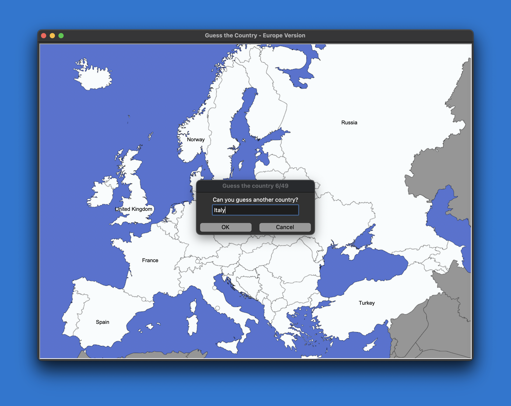

# 🌍 Guess the Country Game - Europe Version

EuroGuess - A game to guess European countries on a map.

This game presents the player with a map of Europe and prompts them to guess the names of various European countries.
The player inputs their guess, and the game checks if it matches the correct name of the country on the map.

The player earns points for each correct guess and can see the country names update on the map throughout the game.
 

## Features

- Large map of Europe for a user-friendly experience.
- Points system to track player performance.
- Option to generate a .csv file containing a list of outstanding countries
    - Enter 'exit' in the text box for this feature


## Installation

- Download and install an IDE - [Visual Studio Code](https://code.visualstudio.com/), [PyCharm](https://www.jetbrains.com/pycharm/) etc
- Download and install [Python](https://www.python.org/downloads/)
- Clone the repository to a local directory - [GitHub Tutorial](https://docs.github.com/en/repositories/creating-and-managing-repositories/cloning-a-repository)
- Open the files in your chosen IDE 
- Install pandas
```
  pip install pandas
```
- Run the main.py file

    
## Screenshots




## Authors

- [@BorivojTodorcic](https://github.com/BorivojTodorcic/)

